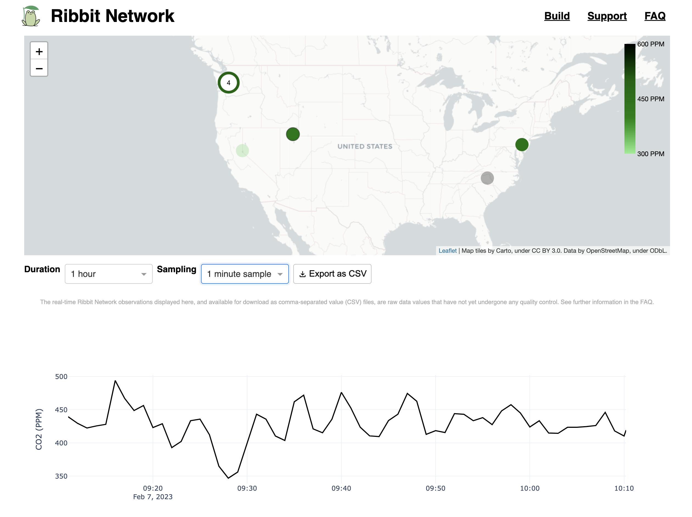

# Ribbit Network Dashboard
[](https://discord.gg/vq8PkDb2TC)
<!-- ALL-CONTRIBUTORS-BADGE:START - Do not remove or modify this section -->
[](#contributors-)
<!-- ALL-CONTRIBUTORS-BADGE:END -->


[This project will create the world's largest Greenhouse Gas Emissions dataset that will empower anyone to join in the work on climate and provide informed data for climate action.](https://ribbitnetwork.org/)

Ribbit Network is a large network of open-source, low-cost, Greenhouse Gas (CO2 and possibly methane) Detection Sensors. These sensor units will be sold by the Ribbit Network and will upload their data to the cloud, creating the world's most complete Greenhouse Gas dataset.

[See more about the Frog Sensors here.](https://github.com/Ribbit-Network/ribbit-network-frog-sensor)

## Dashboard
The Ribbit Network saves the sensor data and makes it accessible for scientists everywhere to analyze and pinpoint emissions. Using this data we can identify and track emissions, allowing us to verify our assumptions about climate and hold ourselves accountable through corporate, government, and individual action.

This repository contains the dashboard for that public information



## Current Status
This dashboard is in it's very earliest version and needs a lot of work.

[Here is the deployed version of this repo which shows the current live sensor data](https://dashboard.ribbitnetwork.org/) (Note this dashboard is still experimental and may be down occasionally).

## Technical Details


The application is built as a [Dash app](https://plotly.com/dash/).

It is currently automatically deployed on [platform.sh](https://platform.sh/) from this repository.

You can run the website locally on your development machine using the following instructions after cloning this repo:

On mac/linux
```
python3 -m venv env
source env/bin/activate
python3 -m pip install -r requirements.txt
python3 app.py
```

In the case you may have recently installed or upgraded python, you might run the app but encounter a local issuer certificate error.  If you do encounter this, run the Install Certificates.command file in your Python folder (see [this issue](https://github.com/Ribbit-Network/ribbit-network-dashboard/issues/98) for more details).

```
python3 -m venv env
env/Scripts/activate
python3 -m pip install -r requirements.txt
python3 app.py
```

On Windows (If using Command Prompt)
```
python3 -m venv env
env\Scripts\activate
python3 -m pip install -r requirements.txt
python3 app.py
```

Once the server is up and running you can visit it locally by going to http://127.0.0.1:8050/

## Contributing
See the [Issues](https://github.com/Ribbit-Network/ribbit-network-dashboard/issues) section of this project for the work that I've currently scoped out to be done. Reach out to me if you are interested in helping out!

The [contributing guide](CONTRIBUTING.md) outlines the process for helping out!

[You can also join our developer discord here.](https://discord.gg/vq8PkDb2TC)

## Questions?
[Check out the Frequently Asked Questions section.](https://github.com/Ribbit-Network/ribbit-network-faq) If you don't see your question, let us know either in a Github Discussion or via Discord.

## Background Information
[See the background research here.](https://ribbitnetwork.notion.site/Lessons-from-other-projects-9bd760f5a2cc4d19be32682e11f4ab11) This project is inspired by some awesome research by incedible scientists in academia.

## Support
Ribbit Network is a non-profit (501c3) creating the world's largest Greenhouse Gas Emissions dataset that will empower anyone to join in the work on climate and provide informed data for climate action. We're an all volunteer team building everything we do in the open-source community.

If you would like to consider sponsoring Ribbit Nework you can do [via this link](https://givebutter.com/ribbitnetwork). The money is used to pay for software fees, purchase R&D hardware and generally support the mission of Ribbit Network.

## Ribbit Network Code of Conduct
By participating in this project, you agree to follow the <a href="https://ribbitnetwork.notion.site/Ribbit-Network-Code-of-Conduct-and-anti-harassment-policy-cc998ef83e7d4ae7abc95508ee6f2b0d">Ribbit Network Code of Conduct and Anti-Harassement Policy</a>.
Violations can be reported anonymously by filling out this <a href="https://docs.google.com/forms/d/e/1FAIpQLSemQSAER8az1lNGoWkL1udsv6O8oPc1WQ3dvQ0b9fJSSMeetQ/viewform"> form </a>. 

## Contributors ✨

Thanks goes to these wonderful people ([emoji key](https://allcontributors.org/docs/en/emoji-key)):

<!-- ALL-CONTRIBUTORS-LIST:START - Do not remove or modify this section -->
<!-- prettier-ignore-start -->
<!-- markdownlint-disable -->
<table>
  <tr>
    <td align="center"><a href="http://brianstrauch.com"><br /><sub><b>Brian Strauch</b></sub></a><br /><a href="https://github.com/Ribbit-Network/ribbit-network-dashboard/commits?author=brianstrauch" title="Code">💻</a> <a href="#design-brianstrauch" title="Design">🎨</a> <a href="#ideas-brianstrauch" title="Ideas, Planning, & Feedback">🤔</a></td>
    <td align="center"><a href="https://github.com/yuzhang0302"><br /><sub><b>Yu Zhang</b></sub></a><br /><a href="https://github.com/Ribbit-Network/ribbit-network-dashboard/commits?author=yuzhang0302" title="Code">💻</a> <a href="#data-yuzhang0302" title="Data">🔣</a> <a href="https://github.com/Ribbit-Network/ribbit-network-dashboard/commits?author=yuzhang0302" title="Documentation">📖</a></td>
    <td align="center"><a href="https://spestana.github.io/"><br /><sub><b>Steven Pestana</b></sub></a><br /><a href="https://github.com/Ribbit-Network/ribbit-network-dashboard/issues?q=author%3Aspestana" title="Bug reports">🐛</a> <a href="https://github.com/Ribbit-Network/ribbit-network-dashboard/commits?author=spestana" title="Code">💻</a></td>
    <td align="center"><a href="https://www.linkedin.com/in/mujeeb-a-abdulfatai-9b4498120/"><br /><sub><b>Mujeeb A. Abdulfatai</b></sub></a><br /><a href="https://github.com/Ribbit-Network/ribbit-network-dashboard/commits?author=Alhaji-trujillo" title="Documentation">📖</a></td>
    <td align="center"><a href="https://rishikavikondala.github.io"><br /><sub><b>Rishi Kavikondala</b></sub></a><br /><a href="https://github.com/Ribbit-Network/ribbit-network-dashboard/commits?author=rishikavikondala" title="Code">💻</a></td>
    <td align="center"><a href="https://github.com/sriki18"><br /><sub><b>Srikiran Chandrasekaran</b></sub></a><br /><a href="https://github.com/Ribbit-Network/ribbit-network-dashboard/commits?author=sriki18" title="Code">💻</a> <a href="https://github.com/Ribbit-Network/ribbit-network-dashboard/pulls?q=is%3Apr+reviewed-by%3Asriki18" title="Reviewed Pull Requests">👀</a></td>
    <td align="center"><a href="https://abesto.net"><br /><sub><b>Zoltán Nagy</b></sub></a><br /><a href="https://github.com/Ribbit-Network/ribbit-network-dashboard/commits?author=abesto" title="Tests">⚠️</a> <a href="https://github.com/Ribbit-Network/ribbit-network-dashboard/commits?author=abesto" title="Code">💻</a></td>
  </tr>
</table>

<!-- markdownlint-restore -->
<!-- prettier-ignore-end -->

<!-- ALL-CONTRIBUTORS-LIST:END -->

This project follows the [all-contributors](https://github.com/all-contributors/all-contributors) specification. Contributions of any kind welcome!
